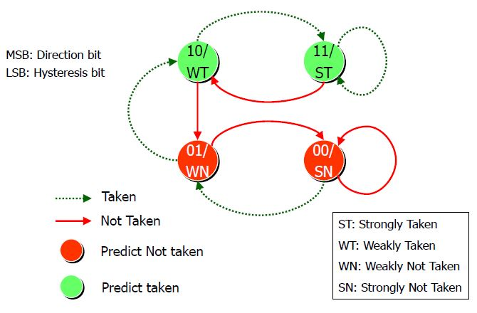

# Branch Predictor FSM & Dynamic Scheduling Lecture Note 20210415

Group #24  
刘玮    718030290012  
马舸轩  718030290010

## Dynamic Branch Predictor

- The dynamic branch predictor predicts if the next branch should be taken or not taken by using a hash table('branch history table). It hashes lower bits ofthe instruction address and stores the actual outcome of the last execution. (`taken` or `not taken`)

- Since the predictor is hashingonly onlower bits of the instructions, there mightbe hash collisions that mayaffect the accuracy of prediction, especially when multiple branch instructions have the same lower bits.


## Update Branch History Table with Finite State Machine


### 1-bit FSM

- 1-bit FSM is the simplest form of branch history table updater. It has 2 states:`0` for `not taken` and `1` for `taken`.
- "Change mind fast": update the table after each conditional branch instruction.
- The 2-state FSM changes between 1 `taken` and 0 `not taken`, based on the previous actual outcome.


If we execute the `for` loop twice, the prediction accuracy would be 60%. **Finding: the larger the times of the loop are, the higher the accuracy is.**


**2-bit FSM**

- 2-bit FSM has an extra bit to indicate the strongness of the prediction. The higher bit is used to indicate the direction of the prediction (`1` for `taken`, and `0` for `not taken`).

2-bit FSM has 4 states:

- Strongly Taken: `11`

- Weakly Taken: `10`

- Weakly Not Taken: `01`

- Strongly Not Taken: `00`

A larger number indicates a greater possibility that the branch will be taken.



Unlike 1-bit FSM, 2-bit FSM does not **change its "mind" fastly**. For example, we need 2 consecutive `not taken` to change the prediction from `strongly taken` to `weakly not taken`.

```

for (i=0; i<5; i++) {...}

addi    r10, r0,  5

addi    r1,  r0,  0

L1:

... ...

addi    r1,  r1,  1

bne     r1,  r10, L1

```


When we execute the same `for` loop twice, the accuracy will be 70%, which is better than 1-bit FSM.


## Dynamic Scheduling

### Motivation

```

DIV.D F4,  F0, F2

ADD.D F10, F4, F8

SUB.D F12, F6, F14

```

`ADD.D` will be stalled due to RAW hazard at `F4`, and the `SUB.D` operation will also be stalled, even though it does not depend on previous instructions, so why cannot we finishSUB.Dbefore ADD.D.

-> We can execute instructions out of order to get more parallelism. But the correctness of execution should be guaranteed.

Dynamic scheduling is the technique that rearranges the order of instructions to reduce stalls while maintaining data flow.

### Advantages

- Compiler doesn't need to have knowledge of microarchitecture.

- Handles cases where dependencies are unknown at compile time.

### Disadvantages

- It may make the hardware more complex.
- Exceptions will be more complicated.


### Key Concepts

- ID stage divided into 2 parts

    1. Check for any structural hazards.

    2. Wait for the absence of a data hazard.

- In order issue, out of order execution

    - Instructions issued in program order, as the traditional approach

    - But start execution as soon as the data operands are available.

Approaches:

- Scoreboard Approach
- Tomasulo's Approach

### Scoreboard Approach

Maintain correctness by keeping tracks of dependencies between issued instructions.

In order to achieve parallelism, there should be multiple instructions in execution. This can be done by using multiple execution unit or using pipelined execution unit.

- ID stages are dividedinto 2 parts:

1. Issue - decode instructions and check if there is any structural hazard.

2. Read operands - wait until all data hazards are resolved,and then read operands

- Instructions are executed when it does not depend on previous instructions and there's no hazard.

- Instructions are issued in program order but are executed and completed out-of-order.

- There is no data forwarding.

- Currently, interruptions and exceptions are not precise.

- May have WAR and WAW hazards.

#### Solution for WAR

- When detecting hazard, it will wait for the former instruction finishing reading the "old value" of the register, then it will update the register value getting from the latter instructoin.

- Only read registers during read operand stage (ID part 2).

#### Solution for WAW

- Detect hazards and stall issuing instruction until other instructions complete.


#### Stages of Scoreboard Control

1. Issue (ID1)

    - Issue instructions in order so that it can check if there is any hazards.

    - Don't issue instruction if 
        - there is any structural hazard, or

        - the instruction depends on other issued but not finished instructions

2. Read (ID2)

    - Wait until all real dependencies are resolved, so there is no RAW hazard.

    - No data forwarding.

3. Execute (EX)

    - Instruction will be executed when all operands are available. Scoreboard will be notified when the instruction is completed.

4. Write Result (WB)

    - Stall untilthere is no read to the target operand. (Resolve WAR)


#### Limitations

- Cannot forward data
- Limit to basic block instructions
- Limited number of functional units
- Don't issue on structural hazard
- It will wait for WAR hazard
 

